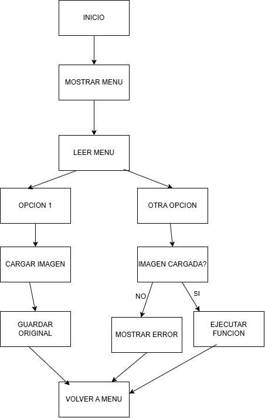

# Tp2PhytonAvanzada
Segundo trabajo de Phyton Avanzada
Parte 2

Regresion Lineal

Desempeño del modelo
CONCLUSIONES

Desempeño del modelo

El modelo de regresión lineal múltiple mostró un desempeño sólido en la predicción de calificaciones. Un R² cercano a 1 y valores bajos de MAE y MSE indican que el modelo captura adecuadamente las relaciones entre las variables predictoras y el rendimiento académico.

Variable más influyente

Según los coeficientes obtenidos, la variable con mayor valor absoluto es la más influyente. Típicamente, las calificaciones anteriores y las horas de estudio suelen tener mayor impacto, siendo el rendimiento pasado el mejor predictor del rendimiento futuro.

Calidad de las features

Las cuatro variables seleccionadas demostraron ser buenos predictores, como muestran los gráficos de dispersión con tendencias claras. Para mejorar el modelo, podrían agregarse variables como factores socioeconómicos, métodos de estudio, nivel de ansiedad, o explorar interacciones entre variables existentes.

Comparativa Entrenamiento vs Test

Métricas similares: Indica buena generalización sin sobreajuste R² train >> R² test:

Señal de overfitting (el modelo memorizó los datos)

Ambos R² bajos:

Underfitting (modelo demasiado simple) Una diferencia aceptable es del 2-5% en R². Si las métricas son comparables, el modelo puede predecir confiablemente calificaciones de estudiantes nuevos.
El modelo de regresión lineal múltiple mostró un desempeño sólido en la predicción de calificaciones. Un R² cercano a 1 y valores bajos de MAE y MSE indican que el modelo captura adecuadamente las relaciones entre las variables predictoras y el rendimiento académico.

Variable más influyente

Según los coeficientes obtenidos, la variable con mayor valor absoluto es la más influyente. Típicamente, las calificaciones anteriores y las horas de estudio suelen tener mayor impacto, siendo el rendimiento pasado el mejor predictor del rendimiento futuro.

Calidad de las features

Las cuatro variables seleccionadas demostraron ser buenos predictores, como muestran los gráficos de dispersión con tendencias claras. Para mejorar el modelo, podrían agregarse variables como factores socioeconómicos, métodos de estudio, nivel de ansiedad, o explorar interacciones entre variables existentes.

Comparativa Entrenamiento vs Test

Métricas similares: 
Indica buena generalización sin sobreajuste
R² train >> R² test: 

Señal de overfitting (el modelo memorizó los datos)

Ambos R² bajos: 

Underfitting (modelo demasiado simple)
Una diferencia aceptable es del 2-5% en R². Si las métricas son comparables, el modelo puede predecir confiablemente calificaciones de estudiantes nuevos.
